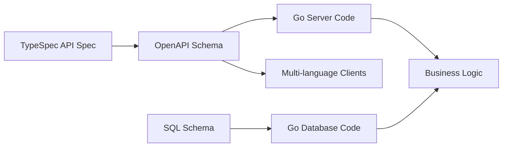

# Facility Reservation System Documentation

Welcome to the documentation for the Facility Reservation System - a REST API service for managing facility bookings and user administration.

## 📋 Documentation Index

### 📋 Product
- **[Product Requirements Document (PRD)](prd.md)** - Complete product vision, user needs, and implementation roadmap
  - User personas, workflows, and success metrics
  - Functional requirements organized by implementation phases
  - Competitive analysis and market positioning

### 🏗️ Architecture
- **[Architecture Overview](architecture.md)** - Complete system architecture using arc42 template
  - System context, building blocks, runtime views
  - Quality requirements, deployment, and crosscutting concepts
  - Links to all related ADRs and design documents

### 🎯 Architecture Decision Records (ADRs)
- **[ADR Index](adr/)** - Key architectural decisions and their rationale
  - [ADR-001: Use TypeSpec over OpenAPI YAML](adr/0001-use-typespec-over-openapi-yaml.md)
  - [ADR-002: Use sqlc over ORM](adr/0002-use-sqlc-over-orm.md)
  - [ADR-003: Avoid Database Triggers](adr/0003-avoid-database-triggers.md)

### 📐 Design Documents
- **[Design Docs Index](design-docs/)** - Detailed designs for complex systems
  - [Code Generation Pipeline](design-docs/001-code-generation-pipeline.md)
  - [API Contract Ecosystem](design-docs/002-api-contract-ecosystem.md)
  - [Development Workflow](design-docs/003-development-workflow.md)


## 🚀 Quick Start

### For Product Managers & Stakeholders
1. **Start here**: [Product Requirements Document (PRD)](prd.md) - Complete product vision and roadmap
2. **Current status**: Phase 0 (foundation) complete, Phase 1 (core booking) in detailed planning
3. **Success metrics**: User adoption, booking efficiency, and system reliability targets

### For New Developers
1. **Product context**: [PRD](prd.md) - Understand what we're building and why
2. **System design**: [Architecture Overview](architecture.md) - Technical system architecture
3. **Daily workflow**: [Development Workflow](design-docs/003-development-workflow.md) for productive development

### For Architects
1. **Product strategy**: [PRD](prd.md) - Business requirements and success criteria
2. **System overview**: [Architecture Overview](architecture.md) - Complete arc42 documentation
3. **Decision context**: [ADR Index](adr/) - Rationale behind architectural choices
4. **Complex systems**: [Design Docs](design-docs/) - Implementation details for sophisticated workflows

### For API Consumers
1. **API specification**: `spec/main.tsp` - TypeSpec definition of all endpoints
2. **Client generation**: [API Contract Ecosystem](design-docs/002-api-contract-ecosystem.md) - How to generate client SDKs
3. **OpenAPI schema**: `spec/tsp-output/schema/3.1.0/openapi.yaml` - Generated OpenAPI specification

## 🛠️ Development Quick Reference

### Essential Commands
```bash
# Setup environment
make db-setup              # Database + initial code generation

# Development cycle  
make build_dev              # Complete build: format, lint, generate, test, compile

# Incremental development
make ogen                   # Regenerate API code only
make sqlc-generate          # Regenerate database code only
make test-short             # Unit tests only
```

### Key Files
- `spec/main.tsp` - API specification (TypeSpec)
- `_db/schema.sql` - Database schema (source of truth)
- `_db/query_*.sql` - SQL queries for code generation
- `internal/service.go` - Business logic implementation

## 📚 Documentation Principles

### Architecture Decision Records (ADRs)
- **One decision per ADR**: Each documents exactly one architectural choice
- **Immutable**: Once accepted, ADRs are never changed (only superseded)
- **Context-rich**: Include enough background for future readers to understand decisions

### Design Documents  
- **Complex systems only**: Document systems that need detailed explanation
- **Living documents**: Updated as systems evolve
- **Implementation-focused**: Provide concrete guidance for development

### Arc42 Architecture
- **Comprehensive overview**: Single source of truth for system architecture
- **Stakeholder-focused**: Addresses concerns of different audiences
- **Cross-referenced**: Links to relevant ADRs and design docs

## 🔄 Documentation Workflow

### Contributing to Documentation
1. **ADRs**: Use template in [adr/README.md](adr/README.md) for new architectural decisions
2. **Design Docs**: Use template in [design-docs/README.md](design-docs/README.md) for complex systems
3. **Architecture**: Update [architecture.md](architecture.md) for system-wide changes

### Keeping Docs Current
- **ADRs**: Create new ADRs for significant architectural changes
- **Design Docs**: Update existing docs as systems evolve  
- **Architecture**: Maintain as single source of truth for overall system design

## 🎯 System Overview

The Facility Reservation System is built with a **schema-driven development** approach:



**Key Characteristics:**
- **Type Safety**: End-to-end type safety from database to API clients
- **Code Generation**: Automated generation of HTTP handlers and database access code
- **Contract-First**: API specification drives both server and client implementation
- **Explicit Behavior**: All business logic visible in application code (no hidden database triggers)

## 🏷️ Technology Stack

| Component | Technology | Purpose |
|-----------|------------|---------|
| **API Specification** | TypeSpec | Type-safe API definition |
| **HTTP Server** | Go + ogen | Generated HTTP handlers |
| **Database** | PostgreSQL + sqlc | Type-safe database access |
| **Schema Management** | Atlas | Database migrations |
| **Testing** | Go testing + external packages | Unit and integration tests |

---

*For detailed information about any topic, follow the links above or browse the documentation directories.*
