# Architecture Documentation

**Facility Reservation System**

Based on arc42 architecture documentation template

## Related Documentation

- **[Architecture Decision Records (ADRs)](adr/)** - Key architectural decisions and their rationale
- **[Design Documents](design-docs/)** - Detailed designs for complex systems and workflows

---

## 1. Introduction and Goals

### 1.1 Requirements Overview

The Facility Reservation System is a REST API service that manages facility bookings and user administration. The system provides:

- **Public facility listing** - Browse available facilities without authentication
- **User management** - Administrative user CRUD operations
- **User profile access** - Authenticated users can view their profile
- **Facility management** - Administrative facility CRUD operations

### 1.2 Quality Goals

| Quality Attribute | Motivation | Priority |
|-------------------|------------|----------|
| **Type Safety** | Eliminate runtime type errors through compile-time guarantees | High |
| **Maintainability** | Code generation ensures consistency between schema and implementation | High |
| **Developer Experience** | Clear build pipeline with automated code generation | High |
| **Reliability** | Database-first approach with schema validation | Medium |
| **Performance** | Connection pooling and efficient query generation | Medium |

### 1.3 Stakeholders

| Role | Contact | Expectations |
|------|---------|--------------|
| **API Consumers** | External applications | RESTful API, clear documentation, consistent responses |
| **Developers** | Development team | Type-safe codebase, clear development workflow |
| **Administrators** | System administrators | User and facility management capabilities |
| **Operations** | DevOps team | Reliable deployment, monitoring capabilities |

---

## 2. Architecture Constraints

### 2.1 Technical Constraints

| Constraint | Background |
|------------|------------|
| **Go Language** | Primary programming language for backend services |
| **PostgreSQL** | Relational database with ACID compliance |
| **REST API** | HTTP-based API following REST principles |
| **Docker** | Containerized development and deployment |

### 2.2 Organizational Constraints 

| Constraint | Background |
|------------|------------|
| **Schema-First Development** | Database schema drives code generation |
| **Code Generation** | Automated generation of API handlers and database code |
| **External Test Packages** | Testing through public interfaces only |

### 2.3 Conventions

| Convention | Rationale |
|------------|-----------|
| **Make-based Build System** | Standardized development commands |
| **Structured Logging** | JSON logging in production, text in development |
| **Migration Management** | Atlas handles schema versioning |

---

## 3. Context and Scope

### 3.1 Business Context

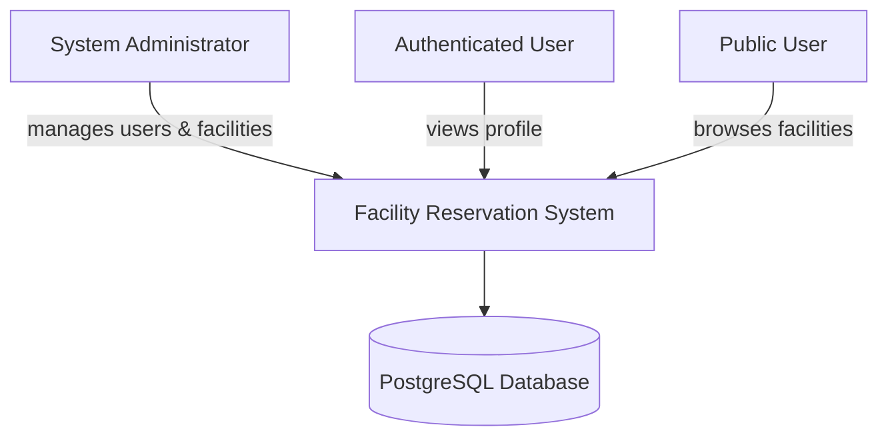

**External Entities:**

- **System Administrator**: Manages users and facilities through admin endpoints
- **Authenticated User**: Access personal profile information  
- **Public User**: Browse available facilities without authentication
- **PostgreSQL Database**: Persistent data storage

### 3.2 Technical Context

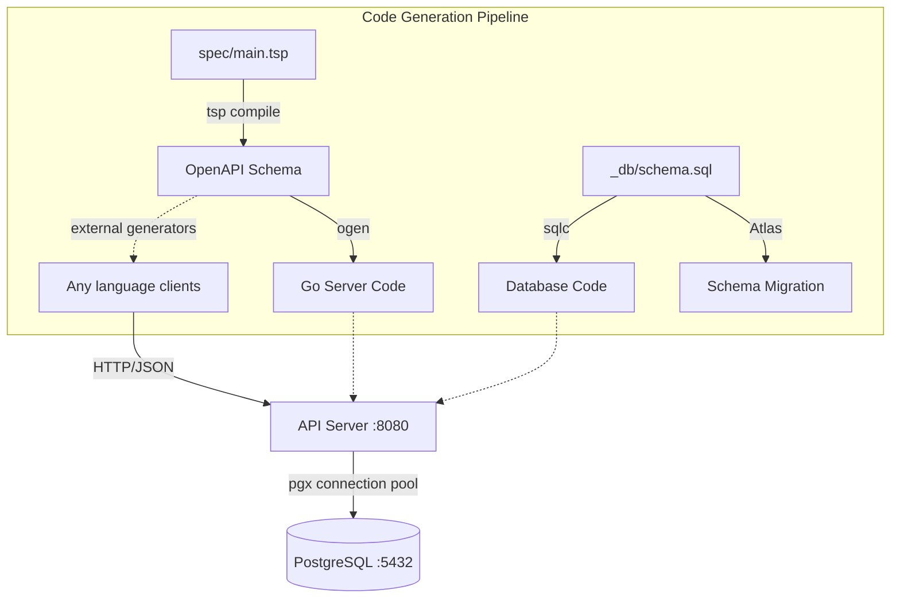

**Technical Interfaces:**

- **HTTP REST API**: JSON-based communication for multiple client types
- **OpenAPI Schema**: Contract-first API specification enabling client generation
- **PostgreSQL Protocol**: Database connectivity via pgx driver
- **Docker Compose**: Development environment orchestration

---

## 4. Solution Strategy

### 4.1 Technology Decisions

| Decision | Rationale | Reference |
|----------|-----------|-----------|
| **TypeSpec + ogen** | Generate type-safe HTTP handlers from OpenAPI specification | [ADR-001](adr/0001-use-typespec-over-openapi-yaml.md) |
| **sqlc** | Generate type-safe Go code from SQL queries | [ADR-002](adr/0002-use-sqlc-over-orm.md) |
| **Atlas** | Schema-as-code database migrations | - |
| **pgx** | High-performance PostgreSQL driver with connection pooling | - |

### 4.2 Top-Level Decomposition

The system follows a **three-layer architecture**:

1. **API Layer** (`api/`) - Generated HTTP handlers and schemas
2. **Service Layer** (`internal/`) - Business logic and database integration  
3. **Database Layer** (`_db/`, `internal/db/`) - Schema and generated queries

### 4.3 Achievement of Quality Goals

| Quality Goal | Approach |
|--------------|----------|
| **Type Safety** | End-to-end code generation from schema to API |
| **Maintainability** | Single source of truth (TypeSpec + SQL schema) |
| **Developer Experience** | Automated build pipeline with `make build-dev` |
| **Reliability** | Schema validation and database constraints |

---

## 5. Building Block View

### 5.1 Whitebox Overall System

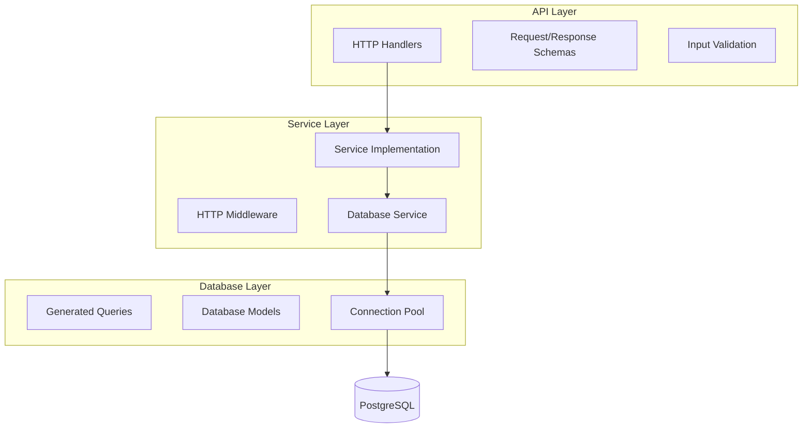

**Component Responsibilities:**

| Component | Responsibility |
|-----------|----------------|
| **HTTP Handlers** | Request routing, parameter binding, response serialization |
| **Service Implementation** | Business logic, request orchestration |
| **Database Service** | Query execution, connection management |
| **Middleware** | Cross-cutting concerns (logging, recovery, CORS) |

### 5.2 Core Domain Components

#### 5.2.1 User Management
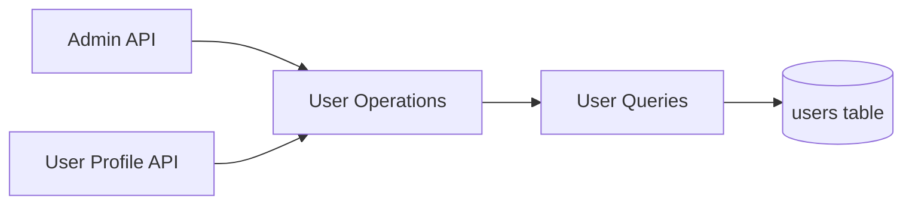

**Responsibilities:**
- User CRUD operations (admin only)
- User profile retrieval (authenticated users)
- User authentication status management

#### 5.2.2 Facility Management  
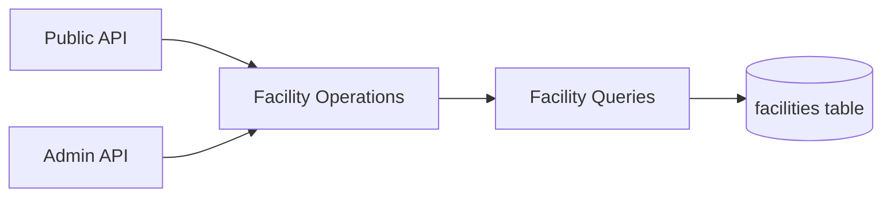

**Responsibilities:**
- Public facility listing
- Facility CRUD operations (admin only)
- Facility visibility and priority management

---

## 6. Runtime View

### 6.1 Standard Request Flow

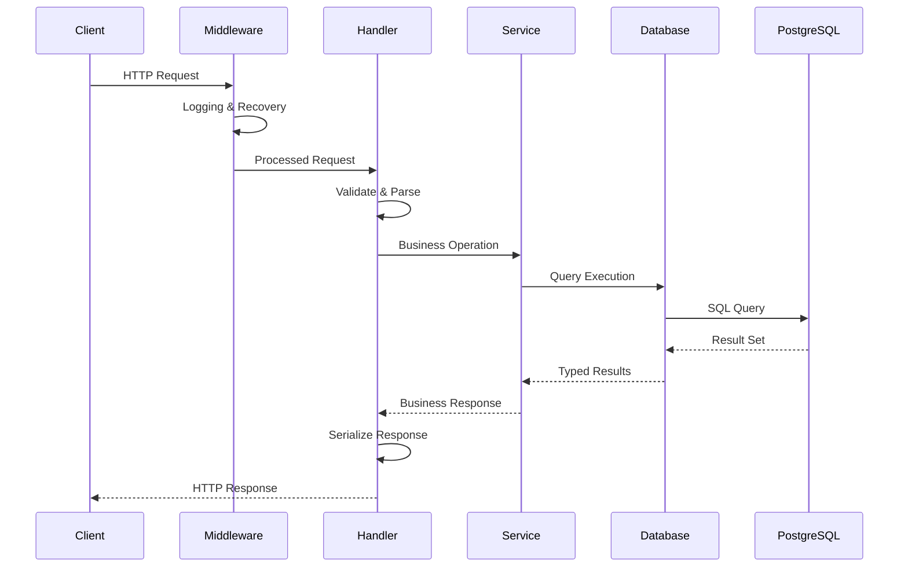

### 6.2 Error Handling Flow

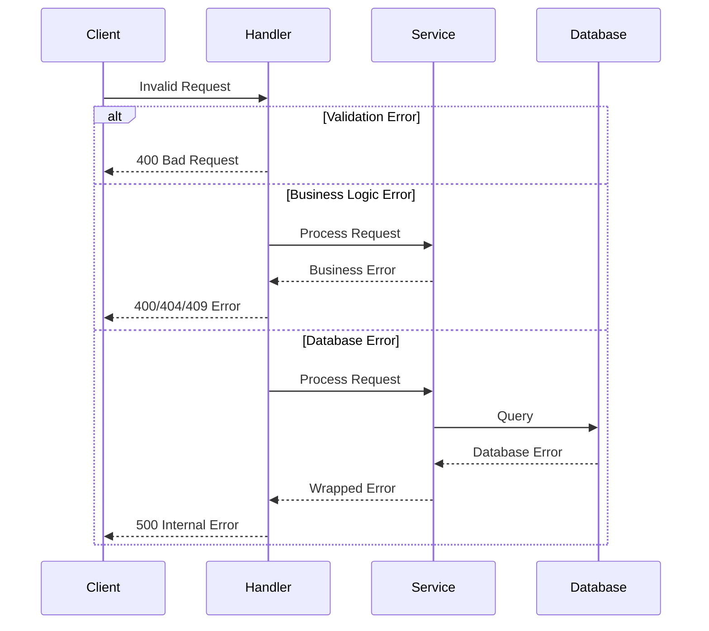

### 6.3 Application Startup

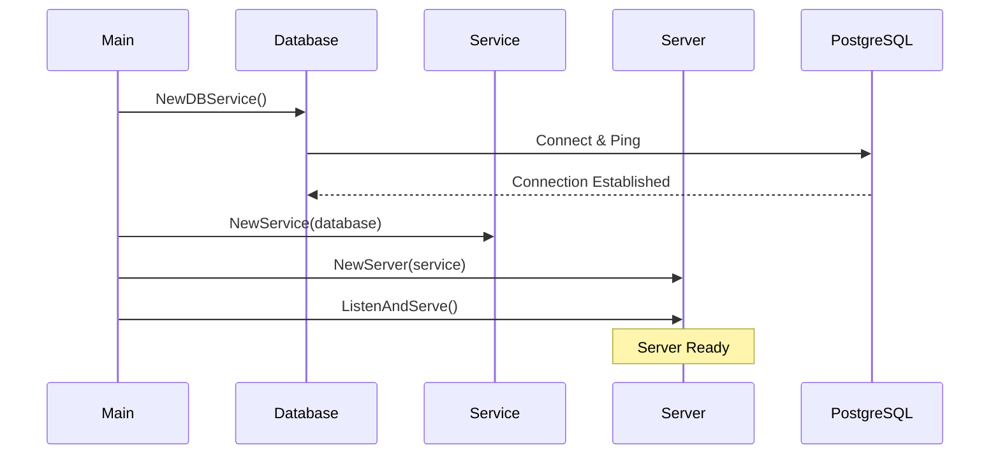

---

## 7. Deployment View

### 7.1 Development Environment

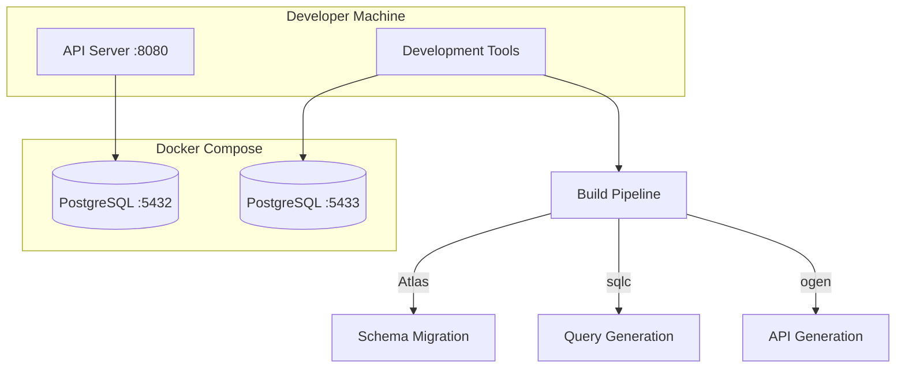

For complete development workflow, see [Development Workflow](design-docs/003-development-workflow.md).

**Infrastructure Components:**

| Component | Configuration | Purpose |
|-----------|---------------|---------|
| **API Server** | Port 8080 | HTTP API endpoint |
| **Development DB** | PostgreSQL 16, Port 5432 | Development data |
| **Test DB** | PostgreSQL 16, Port 5433 | Integration testing |
| **Docker Compose** | Local orchestration | Development environment |

### 7.2 Database Architecture

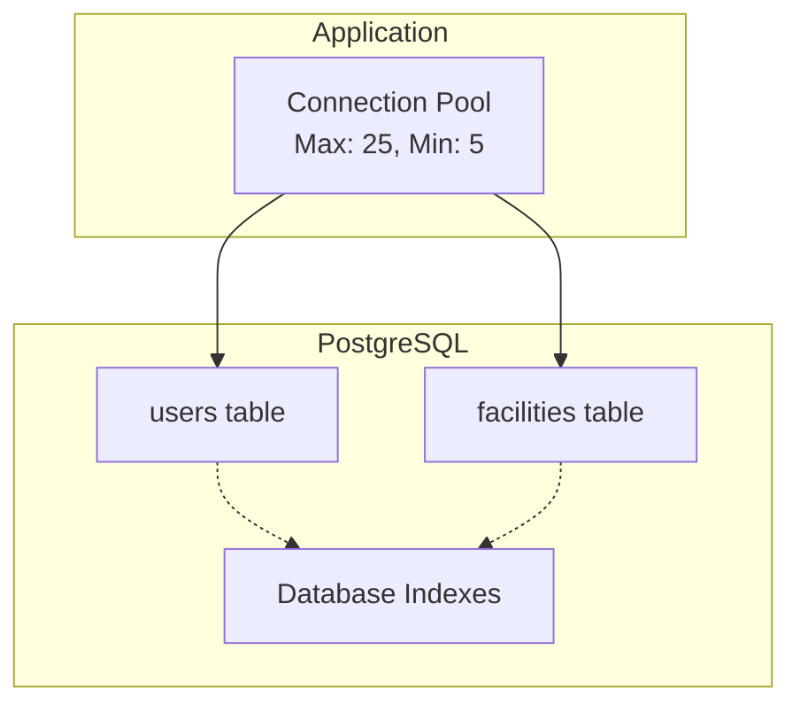

**Database Configuration:**
- **Connection Pool**: 5-25 connections, 30min idle timeout
- **Schema Management**: Atlas migrations
- **Indexing**: Optimized for common queries
- **Timestamp Updates**: Explicit `updated_at = NOW()` in application code

---

## 8. Crosscutting Concepts

### 8.1 Code Generation Strategy

The system uses multiple code generators to maintain consistency. See [Code Generation Pipeline](design-docs/001-code-generation-pipeline.md) for detailed implementation and [API Contract Ecosystem](design-docs/002-api-contract-ecosystem.md) for client generation strategy:

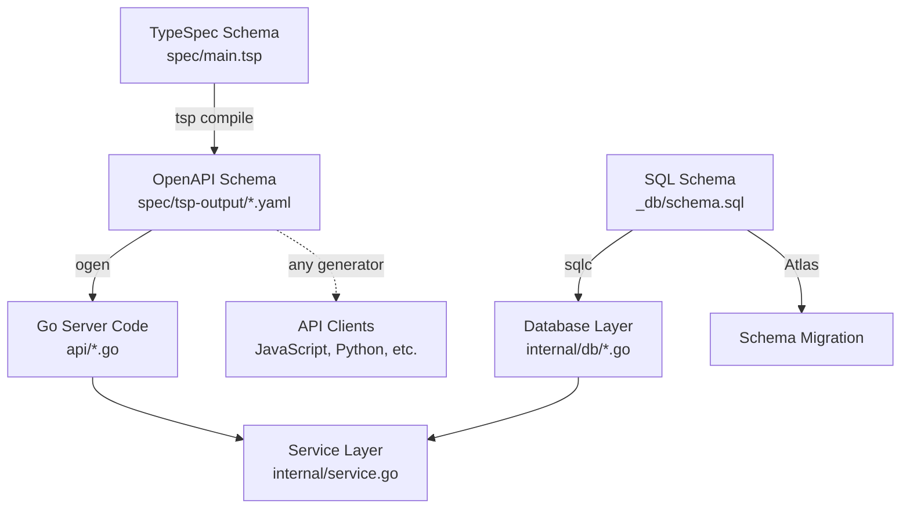

**Benefits:**
- **Single Source of Truth**: TypeSpec schema drives both server and client implementation
- **Client SDK Generation**: OpenAPI schema enables automatic client generation for any language
- **Type Safety**: Compile-time guarantees across server and client layers
- **API Contract**: OpenAPI serves as authoritative API documentation and contract
- **Consistency**: Generated code follows patterns across all implementations
- **Maintainability**: Schema changes propagate automatically to server and clients

### 8.2 Error Handling

**Error Categories:**
1. **Validation Errors** → HTTP 400 Bad Request
2. **Authorization Errors** → HTTP 401/403 
3. **Not Found Errors** → HTTP 404 Not Found
4. **Business Logic Errors** → HTTP 400/409
5. **System Errors** → HTTP 500 Internal Server Error

**Error Response Format:**
```json
{
  "type": "validation_error",
  "title": "Request Validation Failed", 
  "status": 400,
  "detail": "username field is required",
  "instance": "/api/v1/users/"
}
```

### 8.3 Logging and Monitoring

**Logging Strategy:**
- **Development**: Text format for readability
- **Production**: JSON format for structured logging
- **Context Propagation**: Request context throughout call chain
- **Error Tracking**: Wrapped errors with context

**Key Metrics:**
- Request/response logging via middleware
- Database connection pool metrics
- Error rates and response times

### 8.4 Security Concepts

**Current Implementation:**
- **Input Validation**: Generated validators from TypeSpec
- **SQL Injection Prevention**: Parameterized queries via sqlc
- **Error Information Disclosure**: Generic error messages to clients

**Authorization Model:**
- **Public Endpoints**: Facility listing
- **User Endpoints**: Profile access (authentication required)
- **Admin Endpoints**: User and facility management

### 8.5 Database Policies

**Explicit Behavior Policy:**

This system enforces **explicit behavior over implicit database operations** to maintain code clarity and debuggability. See [ADR-003](adr/0003-avoid-database-triggers.md) for detailed rationale.

| Policy | Rationale | Implementation |
|--------|-----------|----------------|
| **No Database Triggers** | Triggers create hidden side effects that are hard to debug and test | All business logic must be explicit in application code |
| **Explicit Timestamp Updates** | Automatic timestamp updates hide when data changes | All UPDATE queries explicitly set `updated_at = NOW()` |
| **Application-Controlled Logic** | Business rules should be visible in application code | Database constraints for data integrity only, not business logic |

**Benefits:**
- **Debuggability**: All data changes are traceable in application logs
- **Testability**: Timestamp updates can be controlled in tests
- **Code Clarity**: No hidden database behavior affects application state
- **Maintainability**: All business logic is visible in the codebase

**Example:**
```sql
-- ❌ Avoid: Hidden trigger behavior
CREATE TRIGGER update_timestamp BEFORE UPDATE...

-- ✅ Prefer: Explicit application control
UPDATE users 
SET username = $1, updated_at = NOW() 
WHERE id = $2
```

---

## 9. Architecture Decisions

### 9.1 Key Technology Choices

| Decision | Considered Alternatives | Rationale |
|----------|------------------------|-----------|
| **ogen vs manual handlers** | Gin, Echo, stdlib | Type safety, OpenAPI compliance, reduced boilerplate |
| **sqlc vs ORM** | GORM, Ent | Performance, explicit SQL, compile-time safety |
| **Atlas vs traditional migrations** | Flyway, golang-migrate | Schema-as-code, automatic diff generation |
| **TypeSpec vs OpenAPI YAML** | Hand-written OpenAPI | Better developer experience, type definitions |
| **pgx vs database/sql** | Standard library | Performance, PostgreSQL-specific features |

### 9.2 Architectural Patterns

| Pattern | Application | Benefit |
|---------|-------------|---------|
| **Repository Pattern** | Database service abstraction | Testability, dependency injection |
| **Code Generation** | API and database layers | Consistency, type safety |
| **Middleware Chain** | Request processing | Separation of concerns |
| **Connection Pooling** | Database access | Performance, resource management |

### 9.3 Testing Strategy

**Test Organization:**
- **External Test Packages**: `package internal_test`
- **Unit Tests**: Business logic with mocked dependencies
- **Integration Tests**: Full database interaction
- **Behavior Testing**: Focus on public APIs

**Test Commands:**
- `make test-short`: Unit tests only
- `make test-integration`: Database integration tests  
- `make test_all`: Complete test suite

---

## 10. Quality Requirements

### 10.1 Performance Requirements

| Requirement | Target | Measurement |
|-------------|--------|-------------|
| **Response Time** | < 100ms (95th percentile) | HTTP request duration |
| **Throughput** | > 1000 requests/second | Concurrent request handling |
| **Database Connections** | 5-25 concurrent | Connection pool utilization |

### 10.2 Reliability Requirements

| Requirement | Approach |
|-------------|----------|
| **Data Consistency** | Database transactions, ACID compliance |
| **Error Recovery** | Graceful error handling, recovery middleware |
| **Connection Resilience** | Connection pooling with retry logic |

### 10.3 Maintainability Requirements

| Requirement | Implementation |
|-------------|----------------|
| **Code Consistency** | Code generation from single source |
| **Build Automation** | `make build-dev` pipeline |
| **Schema Evolution** | Atlas migration management |
| **Testing Coverage** | Comprehensive unit and integration tests |

### 10.4 Security Requirements

| Requirement | Status |
|-------------|--------|
| **Input Validation** | ✅ Generated validators |
| **SQL Injection Prevention** | ✅ Parameterized queries |
| **Authentication** | 🔄 To be implemented |
| **Authorization** | 🔄 Basic admin/user distinction |
| **HTTPS/TLS** | 🔄 To be configured |

---

## 11. Risks and Technical Debt

### 11.1 Current Limitations

| Risk | Impact | Mitigation |
|------|--------|------------|
| **No Authentication System** | High | Implement JWT or session-based auth |
| **Limited Authorization** | Medium | Role-based access control system |
| **No Rate Limiting** | Medium | Add middleware for rate limiting |
| **Single Database** | Medium | Add read replicas for scaling |

### 11.2 Technical Debt

| Debt Item | Priority | Effort |
|-----------|----------|--------|
| **Authentication Implementation** | High | 2-3 weeks |
| **API Documentation** | Medium | 1 week |
| **Monitoring/Metrics** | Medium | 1-2 weeks |
| **Production Configuration** | Medium | 1 week |

### 11.3 Scalability Considerations

**Current Constraints:**
- Single PostgreSQL instance
- In-memory session management (not implemented)
- No caching layer

**Future Scaling Options:**
- Database read replicas
- Redis for session storage
- Load balancing multiple API instances
- CDN for static content

---

## 12. Glossary

### 12.1 Domain Terms

| Term | Definition |
|------|------------|
| **Facility** | A bookable resource (room, equipment, space) |
| **User** | Person with system access (regular user or administrator) |
| **Admin User** | User with administrative privileges |
| **Reservation** | Booking of a facility for specific time period (future feature) |

### 12.2 Technical Terms

| Term | Definition |
|------|------------|
| **TypeSpec** | Microsoft's API specification language |
| **ogen** | OpenAPI v3 code generator for Go |
| **sqlc** | SQL compiler generating type-safe Go code |
| **Atlas** | Database schema migration tool |
| **pgx** | PostgreSQL driver and toolkit for Go |
| **Connection Pool** | Reusable database connection management |

### 12.3 Build System

For complete development commands and build system documentation, see [Development Workflow](design-docs/003-development-workflow.md).

---

*This document follows the arc42 template for architecture documentation.*