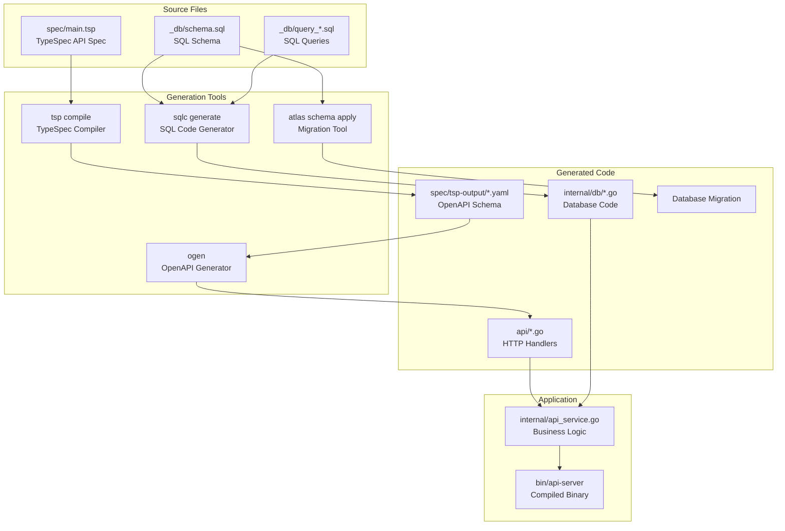

# 1. Code Generation Pipeline

**Author**: System Architecture Team  
**Status**: Active  
**Last Updated**: 2025-06-14

## Goals

- Provide a comprehensive understanding of the code generation pipeline
- Explain dependencies between different generation tools
- Document the build process for new developers
- Establish patterns for extending the generation pipeline

## Non-Goals

- Detailed tool-specific configuration (covered in individual tool docs)
- Alternative build systems or CI/CD pipeline design
- Performance optimization of the build process

## Overview

The Facility Reservation System uses a sophisticated code generation pipeline that transforms declarative specifications into type-safe Go code. The pipeline consists of two parallel tracks:

1. **API Track**: TypeSpec → OpenAPI → Go HTTP handlers
2. **Database Track**: SQL Schema → Go database code + migrations

These tracks are orchestrated by the `make build_dev` command, which ensures proper dependency ordering and validates the entire system.

## Detailed Design

### Pipeline Architecture



### Build Command Breakdown

The build pipeline executes these steps in order:
1. Clean previous artifacts
2. Format and lint code  
3. Generate database code
4. Generate API code
5. Run tests
6. Build binary

For complete build commands and workflow, see [Development Workflow](003-development-workflow.md).

### API Generation Track

**Step 1: TypeSpec Compilation**
```bash
cd ./spec && tsp compile .
```
- Input: `spec/main.tsp` (TypeSpec specification)
- Output: `spec/tsp-output/schema/3.1.0/openapi.yaml` (OpenAPI v3.1)
- Validation: TypeSpec compiler checks type consistency and API design

**Step 2: Go Server Generation**
```bash
ogen -target api -package api --clean ./spec/tsp-output/schema/3.1.0/openapi.yaml
```
- Input: Generated OpenAPI YAML
- Output: `api/*.go` files (handlers, schemas, validation)
- Features: Type-safe HTTP handlers, request/response serialization, input validation

### Database Generation Track

**Step 1: Query Code Generation**
```bash
sqlc generate
```
- Input: `_db/schema.sql` + `_db/query_*.sql`
- Output: `internal/db/*.go` (type-safe query functions)
- Features: Compile-time SQL validation, type-safe parameter binding

**Step 2: Schema Migration** (development only)
- Input: `_db/schema.sql`
- Output: Updated database schema
- Features: Automatic migration generation, schema drift detection

### Integration Points

**Service Layer Integration**
```go
// internal/api_service.go connects generated code
type Service struct {
    api.UnimplementedHandler  // Generated API interface
    db *DatabaseService       // Generated database queries
}
```

**Testing Integration**
- Unit tests use mocked database interfaces
- Integration tests use real database with generated schema
- Generated validation ensures consistency between tests and production

## Alternatives Considered

### Alternative 1: Manual HTTP Handlers
**Pros**: Direct control, no compilation step  
**Cons**: Boilerplate code, no compile-time API validation  
**Rejected**: Type safety and consistency benefits outweigh complexity

### Alternative 2: Traditional ORM
**Pros**: Familiar patterns, automatic relationships  
**Cons**: Runtime query generation, performance unpredictability  
**Rejected**: ADR-002 documents detailed rationale

### Alternative 3: Single-Stage Build
**Pros**: Simpler build process  
**Cons**: No incremental compilation, harder to debug failures  
**Rejected**: Multi-stage approach provides better error messages and faster iteration

## Testing Strategy

### Build Pipeline Tests
- **Unit Tests**: Each generation tool validates its inputs
- **Integration Tests**: End-to-end build process validation
- **Smoke Tests**: Generated code compiles and basic functionality works

### Generated Code Tests
- **API Tests**: Generated handlers respond correctly to valid/invalid inputs
- **Database Tests**: Generated queries produce expected results
- **Type Safety Tests**: Compile-time verification of type consistency

### Build Process Validation
```bash
# Clean build test
make clean && make build_dev

# Incremental build test
touch spec/main.tsp && make build_dev

# Error handling test
# (introduce syntax error and verify clear error messages)
```

## Future Considerations

### Potential Improvements
- **Build Caching**: Cache generated artifacts for faster incremental builds
- **Parallel Generation**: Run API and database tracks in parallel
- **Better Error Messages**: Improve error correlation between tools
- **IDE Integration**: Better development experience with generated code

### Scalability Considerations
- **Multiple APIs**: Support for additional TypeSpec specifications
- **Database Sharding**: Schema generation for multiple databases
- **Client Generation**: Automate client SDK generation for external consumers

### Known Limitations
- **Tool Dependencies**: Requires specific versions of generation tools
- **Debug Complexity**: Errors may span multiple generation stages
- **Learning Curve**: New developers need to understand entire pipeline

### Migration Path
If the pipeline needs significant changes:
1. Implement new approach alongside existing system
2. Migrate one component at a time (API or database)
3. Validate each step with comprehensive testing
4. Document migration process in new design doc