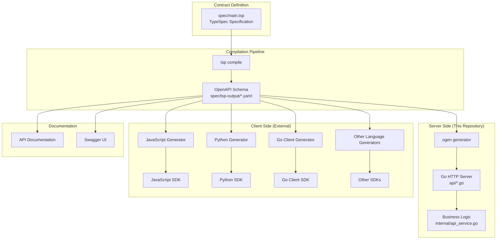

# 2. API Contract Ecosystem

**Author**: System Architecture Team  
**Status**: Active  
**Last Updated**: 2025-06-14

## Goals

- Explain how TypeSpec enables a complete API ecosystem
- Document the relationship between server and client code generation
- Provide guidance for API evolution and versioning
- Establish patterns for contract-first development

## Non-Goals

- Specific client implementation details for different languages
- API versioning strategy (separate design doc)
- Authentication/authorization implementation
- Performance optimization of API endpoints

## Overview

The API Contract Ecosystem centers around a single TypeSpec specification that generates both server implementation and enables client SDK generation across multiple programming languages. This approach ensures consistency between server and all clients while providing type safety and automatic updates.

The ecosystem consists of:
1. **Contract Definition**: TypeSpec specification as single source of truth
2. **Server Generation**: Go HTTP server with type-safe handlers
3. **Client Enablement**: OpenAPI schema for multi-language client generation
4. **Documentation**: Automatic API documentation generation

## Detailed Design

### Ecosystem Architecture



### TypeSpec Contract Design

**Core Models**
```typescript
// User management models
model AdminUser {
  @visibility(Lifecycle.Read) id: integer;
  @visibility(Lifecycle.Read) url: url;
  @maxLength(150) @pattern("^[\\w.@+-]+$") username: string;
  email?: EmailString;
  is_staff?: boolean;
}

model CurrentUser {
  @visibility(Lifecycle.Read) id: integer;
  @maxLength(150) @pattern("^[\\w.@+-]+$") username: string;
  @format("email") email?: string;
}

// Facility management models
model PublicFacility {
  @visibility(Lifecycle.Read) id: integer;
  @maxLength(100) name: string;
  description?: string;
  @maxLength(255) location?: string;
  @minValue(0) priority?: int64;
  is_active?: boolean;
  @visibility(Lifecycle.Read) created_at?: utcDateTime;
  @visibility(Lifecycle.Read) updated_at?: utcDateTime;
}
```

**API Endpoint Organization**
```typescript
// Admin operations (authentication required)
@tag("admin") @route("/api/v1/admin/users/")
op admin_users_list(): AdminUser[] | ErrorResponse;

@tag("admin") @route("/api/v1/admin/users/")
op admin_users_create(@body user: AdminUser): AdminUser | ErrorResponse;

// Public operations (no authentication)
@tag("facilities") @route("/api/v1/facilities/")
op facilities_list(): PublicFacility[] | ErrorResponse;

// User operations (user authentication required)
@tag("me") @route("/api/v1/me/")
op me_retrieve(): CurrentUser | ErrorResponse;
```

### Server Code Generation

**Generated Components**
1. **HTTP Handlers**: Type-safe request/response handling
2. **Request Validation**: Automatic input validation based on TypeSpec constraints
3. **Response Serialization**: Consistent JSON serialization
4. **OpenAPI Documentation**: Runtime API documentation endpoint

**Integration Pattern**
```go
// Generated interface (api/oas_interfaces_gen.go)
type Handler interface {
    AdminUsersCreate(ctx context.Context, req AdminUsersCreateRequest) (AdminUsersCreateResponse, error)
    AdminUsersList(ctx context.Context) (AdminUsersListResponse, error)
    FacilitiesList(ctx context.Context) (FacilitiesListResponse, error)
    // ... other endpoints
}

// Business logic implementation (internal/api_service.go)
type Service struct {
    api.UnimplementedHandler  // Embed generated interface
    db *DatabaseService       // Database access
}

func (s *Service) AdminUsersCreate(ctx context.Context, req api.AdminUsersCreateRequest) (api.AdminUsersCreateResponse, error) {
    // Implementation uses generated types and database layer
    user := req.Body
    created, err := s.db.Queries().CreateUser(ctx, s.db.Pool(), db.CreateUserParams{
        Username:     user.Username,
        Email:        user.Email,
        IsStaff:      user.IsStaff.Value,
        PasswordHash: "placeholder", // TODO: proper password handling
    })
    if err != nil {
        return &api.AdminUsersCreateInternalServerError{}, err
    }
    
    return &api.AdminUsersCreateCreated{
        Data: api.AdminUser{
            ID:       created.ID,
            Username: created.Username,
            Email:    created.Email,
            IsStaff:  api.NewOptBool(created.IsStaff),
        },
    }, nil
}
```

### Client SDK Generation

**Multi-Language Support**
The OpenAPI schema enables client generation for any language:

```bash
# JavaScript/TypeScript
npx @openapitools/openapi-generator-cli generate \
  -i spec/tsp-output/schema/3.1.0/openapi.yaml \
  -g typescript-fetch \
  -o ./clients/typescript

# Python
openapi-python-client generate \
  --url spec/tsp-output/schema/3.1.0/openapi.yaml

# Go client
oapi-codegen -package client \
  spec/tsp-output/schema/3.1.0/openapi.yaml > client.go
```

**Type Safety Across Languages**
- **Server**: Go types generated from TypeSpec
- **JavaScript**: TypeScript interfaces generated from OpenAPI
- **Python**: Pydantic models generated from OpenAPI
- **Other Languages**: Native type systems based on OpenAPI schema

### Contract Evolution Strategy

**Backward Compatibility**
```typescript
// Safe changes (backward compatible)
model PublicFacility {
  // ✅ Adding optional fields
  capacity?: int32;
  
  // ✅ Adding new endpoints
  // ✅ Relaxing validation constraints
}

// Breaking changes (require versioning)
model PublicFacility {
  // ❌ Removing fields
  // ❌ Changing field types
  // ❌ Making optional fields required
  // ❌ Adding required fields
}
```

**Change Management Process**
1. **Design Phase**: Review TypeSpec changes for compatibility impact
2. **Implementation**: Update server implementation to handle new contract
3. **Testing**: Validate backward compatibility with existing clients
4. **Release**: Deploy server changes first, then update clients
5. **Documentation**: Update API docs and client SDK documentation

## Alternatives Considered

### Alternative 1: OpenAPI-First
**Pros**: Direct control over OpenAPI schema, familiar to most teams  
**Cons**: No compile-time validation, verbose YAML, harder to maintain consistency  
**Rejected**: TypeSpec provides better developer experience and type safety

### Alternative 2: gRPC with Protocol Buffers
**Pros**: Strong typing, efficient serialization, built-in client generation  
**Cons**: Not REST, requires gRPC infrastructure, less accessible to web clients  
**Rejected**: REST requirement for broader ecosystem compatibility

### Alternative 3: GraphQL Schema
**Pros**: Single endpoint, client-controlled queries, strong type system  
**Cons**: Different paradigm from REST, additional complexity, learning curve  
**Rejected**: REST requirement and team preference for simpler HTTP semantics

## Testing Strategy

### Contract Testing
```bash
# Schema validation
make tsp  # Ensures TypeSpec compiles without errors

# Generated code validation
make ogen  # Ensures OpenAPI generates valid Go code
go build ./api/...  # Ensures generated code compiles
```

### Client Compatibility Testing
```bash
# Test that OpenAPI schema is valid for client generation
npx @openapitools/openapi-generator-cli validate \
  -i spec/tsp-output/schema/3.1.0/openapi.yaml

# Generate sample client to test schema compatibility
npx @openapitools/openapi-generator-cli generate \
  -i spec/tsp-output/schema/3.1.0/openapi.yaml \
  -g typescript-fetch \
  -o /tmp/test-client
```

### End-to-End Integration Testing
- **Server Tests**: Validate generated handlers work correctly
- **Schema Tests**: Ensure OpenAPI schema matches server behavior
- **Documentation Tests**: Verify API documentation is accurate

## Future Considerations

### Potential Improvements
- **API Versioning**: Design strategy for breaking changes
- **Client SDK Repository**: Centralized distribution of generated clients
- **Real-time Updates**: WebSocket or Server-Sent Events support
- **Advanced Authentication**: OAuth2, JWT token handling in TypeSpec

### Ecosystem Expansion
- **Mobile SDKs**: Native iOS and Android client generation
- **CLI Tools**: Command-line client generation
- **Monitoring Integration**: OpenTelemetry tracing for generated clients
- **Mock Services**: Automatic mock server generation for testing

### Known Limitations
- **OpenAPI Features**: Some OpenAPI features not available in TypeSpec
- **Custom Serialization**: Limited control over JSON serialization format
- **Client Customization**: Generated clients may need post-processing
- **Documentation**: Limited control over generated API documentation format

### Migration Considerations
If the contract approach needs significant changes:
1. **Dual Contracts**: Maintain both old and new contracts during transition
2. **Versioned Endpoints**: Use URL versioning for breaking changes
3. **Client Migration**: Provide migration guides for each supported language
4. **Deprecation Timeline**: Clear communication about contract evolution